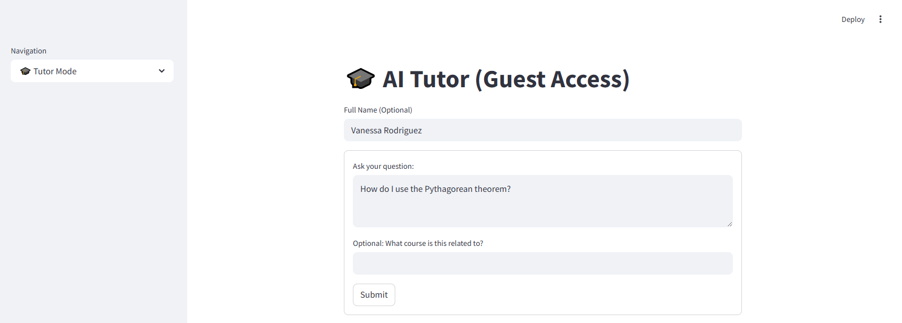
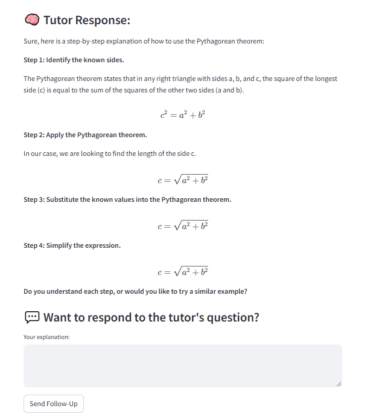

# AI-Powered Tutor Module

> A personalized, on-demand AI tutoring system for college students at Miami Dade College, built with FastAPI, Streamlit, and a locally-hosted Gemma LLM via Ollama.

**Author:** Karla Lopez
**Course:** CAI3303C, Natural Language Processing
**Project Type:** Class project. AI-Powered Personalized Tutor Module.
**Status:** Phase 1 complete. Web-based AI tutor with general education subject support.

---

## Table of Contents

1. [Project Overview](#project-overview)
2. [Scope and Pivot](#scope-and-pivot)
3. [Key Features](#key-features)
4. [System Architecture](#system-architecture)
5. [Project Structure](#project-structure)
6. [Technology Stack](#technology-stack)
7. [Installation & Setup](#installation--setup)
8. [How to Run the Application](#how-to-run-the-application)
9. [API Endpoints](#api-endpoints)
10. [Module Breakdown](#module-breakdown)
11. [User Interface](#user-interface)
12. [What Has Been Done (Completed Work)](#what-has-been-done-completed-work)
13. [Future Expansion](#future-expansion)
14. [License & Acknowledgments](#license--acknowledgments)

---

## Project Overview

The AI-Powered Tutor Module provides personalized, on-demand tutoring to college students by adapting to individual needs through AI-driven insights and recommendations. It draws inspiration from Together AI's LlamaTutor framework and the adaptive-learning concepts of OATutor, but it runs entirely on a local Gemma model via Ollama, which makes it cost-free, private, and fully self-hosted.

### Why This Project Exists: Complementing Brainfuse Tutoring

Miami Dade College already offers Brainfuse Tutoring, a valuable academic resource with live help, writing labs, and subject-specific assistance. Even so, students often run into limited availability, wait times, or just plain difficulty articulating what they need to ask. The Tutor Module is designed as a front-line companion to Brainfuse rather than a replacement:

- **24/7 first-line support.** Students can ask questions anytime without waiting for a live tutor.
- **Question shaping.** Students who aren't sure what to ask can work through their confusion with the AI before connecting with Brainfuse.
- **Demand reduction.** Routine "how do I solve this?" questions are handled by the AI, freeing live tutors for higher-stakes help.
- **Smart hand-off.** The module can guide students to Brainfuse when live human help is genuinely needed.
- **Learning-trend visibility.** Interaction logs help faculty and tutors understand where students are struggling at scale.

The result is a force multiplier for MDC's existing tutoring infrastructure, not a competitor to human tutoring.

### Mission

To deliver an adaptive learning experience that:

- Helps students master course concepts at their own pace
- Provides instant, conversational feedback
- Generates fresh practice problems on demand
- Surfaces curated visual aids and external resources
- Logs interaction history for future analytics and personalization

### Target Users

- **Primary:** College students at Miami Dade College
- **Secondary:** Faculty, academic advisors, and administrators (future analytics layer)

### Subjects Currently Supported

The system was built with a modular subject-detection layer. Phase 1 supports:

- **Mathematics:** College Algebra, Pre-Algebra, Calculus, Statistics, Trigonometry, Geometry, Precalculus, Intermediate Algebra, and Dosage Calculation
- **English:** College Reading, Writing, ESL, English Composition
- **Science:** Biology, Anatomy & Physiology, Chemistry, Organic Chemistry, Physics
- **General:** fallback for any other subject

---

## Scope and pivot

The original proposal (see [`docs/original_proposal.pdf`](docs/original_proposal.pdf)) called for a system built on Together.ai's LlamaTutor framework with cloud LLM access, LMS integration, knowledge graphs, and a multi-phase deployment.

**LLM standardization (class-wide constraint).** The Tutor Module was one component in a larger Skyy MDC system being built across the class. Because the components had to interoperate, the cohort standardized on a single locally-runnable LLM: Gemma via Ollama. This shifted the architecture from a cloud API-based system to a local-first, self-hosted one. That tradeoff had a real benefit for the educational use case. Student questions never leave the local machine, which matters for FERPA-sensitive tutoring data.

**Scope reduction (single-semester reality).** Phase 1 is what's in this repo. It delivers the working tutoring loop: subject-aware prompts, practice generation, curated resources, history persistence, and a Streamlit UI. LMS integration, OAuth, knowledge graphs, and adaptive learning paths are documented in [Future Expansion](#future-expansion).

**What stayed the same.** The core problem didn't change. MDC students still need 24/7 tutoring support that complements Brainfuse, and the modular architecture lets future phases plug in without refactoring.

---

## Key Features

### 1. Conversational AI Tutoring
- Subject-aware prompt engineering tailored to Math, English, Biology, and general topics
- Step-by-step explanations using LaTeX formatting for math
- Encouraging, college-level tone designed by a real educator

### 2. Auto-Detection of Subject and Concept
- If the student does not specify a subject, the system infers it from keywords in the question
- Concept extraction maps user questions to a curated keyword library (e.g., `quadratic_equations`, `photosynthesis`, `thesis_statement`)

### 3. Practice Question Generator
- Generates **brand new** multiple-choice problems based on the concept the student just explored
- Enforces variety with explicit instructions to avoid reusing or rewording the original question
- Randomizes which option (A/B/C/D) is correct to prevent answer-key bias
- Subject-specific formats for Math (LaTeX), Science (diagram references), and English (grammar/writing tasks)

### 4. Curated Resources & Visual Aids
- Pre-mapped Khan Academy, YouTube, and official educational resources for high-traffic concepts
- Visual learning library covering diagrams (e.g., quadratic graphs, photosynthesis, cell structure, thesis statement structure)
- Dynamic fallback that constructs a YouTube/Google search URL when no curated match exists

### 5. Recommendation Engine
- Targeted study suggestions for known struggle topics (e.g., Quadratic Equations, Thesis Statements)
- Course-aware fallbacks (math → Khan Academy, English → Purdue OWL/Grammarly, etc.)

### 6. Interaction History
- Every Q&A is timestamped and persisted to `qa_history.json`
- Filterable by `student_id`, `course`, and date range
- Foundation for future analytics, instructor reports, and adaptive learning paths

### 7. User Registration
- Lightweight email-based registration with validation
- Profiles persisted to `user_profiles.json`
- Supports both registered users and guest mode

### 8. Interactive Streamlit Frontend
- Tutor Mode with a follow-up flow ("Did you understand?" → Yes/Not Sure/No)
- Practice mode with hide/reveal answer mechanics
- Clarification flow that loops back to the AI for re-explanation
- Inline LaTeX rendering for math, image rendering for visuals, video embeds for YouTube

---

## System Architecture

```
┌─────────────────────────┐      ┌──────────────────────────┐
│   Streamlit UI          │      │   FastAPI Backend        │
│   (tutor_ui.py)         │◄────►│   (main.py + routes.py)  │
│                         │ HTTP │                          │
│  - Tutor Mode           │      │  /tutor/query            │
│  - Practice Mode        │      │  /tutor/practice         │
│  - Registration         │      │  /tutor/recommend        │
│  - Clarification        │      │  /history                │
└─────────────────────────┘      └────────────┬─────────────┘
                                              │
                          ┌───────────────────┼───────────────────┐
                          │                   │                   │
                          ▼                   ▼                   ▼
                ┌──────────────────┐ ┌──────────────────┐ ┌──────────────────┐
                │ prompt_engine.py │ │  recommender.py  │ │   history.py     │
                │ Subject-aware    │ │  Resources +     │ │  Q&A logging     │
                │ prompt builder   │ │  Visual lookups  │ │  (JSON-backed)   │
                └────────┬─────────┘ └──────────────────┘ └──────────────────┘
                         │
                         ▼
                ┌──────────────────┐
                │ gemma_engine.py  │
                │ HTTP → Ollama    │──────► http://localhost:11434
                │ (gemma:2b)       │        (Local Gemma model)
                └──────────────────┘
```

A few design choices worth calling out:

- **Decoupled UI/API.** The Streamlit frontend communicates with FastAPI over HTTP, so the UI can be swapped (web, mobile, LMS plugin) without touching the AI logic.
- **Local-first AI.** Gemma runs through Ollama on `localhost:11434`, eliminating API costs and keeping student data private.
- **JSON-backed persistence.** Lightweight storage that's perfect for prototyping, and ready to migrate to PostgreSQL or MongoDB for production.

---

## Project Structure

```
Tutor Module/
├── app/
│   ├── main.py              # FastAPI entry point + Gemma warm-up on startup
│   ├── routes.py            # All API endpoints + auto-detection helpers
│   ├── models.py            # Pydantic request/response schemas
│   ├── gemma_engine.py      # Local Gemma/Ollama HTTP client
│   ├── prompt_engine.py     # Subject-aware prompt builders
│   ├── recommender.py       # Resources, visuals, and recommendations
│   ├── history.py           # Q&A logging and retrieval
│   ├── user_manager.py      # User registration and profiles
│   ├── tutor_ui.py          # Streamlit frontend
│   └── test_api.py          # Quick API smoke test
│
├── static/                  # Curated visual assets
│   ├── math/                # Pythagorean, slope-intercept, etc.
│   ├── english/             # Essay structure, parts of speech
│   └── science/             # DNA helix, cell diagrams, periodic table
│
├── screenshots/             # UI screenshots for documentation
│   ├── ui.PNG
│   └── response.PNG
│
├── qa_history.json          # Persisted Q&A interaction log (gitignored)
├── user_profiles.json       # Registered user profiles (gitignored)
├── requirements.txt         # Pinned Python dependencies
├── .gitignore               # Excludes venv, runtime data, IDE files
└── venv/                    # Python virtual environment (gitignored)
```

---

## Technology Stack

| Layer | Technology | Purpose |
|---|---|---|
| **Frontend** | Streamlit | Interactive web UI |
| **Backend API** | FastAPI | RESTful endpoints |
| **Validation** | Pydantic | Request/response schemas |
| **AI Model** | Gemma 2B via Ollama | Local LLM inference, small enough for consumer hardware |
| **HTTP Client** | `requests` | Frontend ↔ Backend, Backend ↔ Ollama |
| **Persistence** | JSON files | Lightweight storage for Q&A and users |
| **Math Rendering** | LaTeX (via `st.latex`) | Inline math display |
| **Server** | Uvicorn | ASGI server for FastAPI |

---

## Installation & Setup

### Prerequisites

1. **Python 3.10+**
2. **Ollama** installed locally ([https://ollama.com](https://ollama.com))
3. **~4 GB free RAM** (gemma:2b uses ~1.7 GB plus overhead)
4. The **Gemma 2B** model pulled in Ollama:
   ```bash
   ollama pull gemma:2b
   ```

### Step 1: Clone the Project

```bash
git clone <your-repo-url>
cd Tutor_Module-master
```

### Step 2: Create and Activate a Virtual Environment

```bash
python -m venv venv
# Windows
venv\Scripts\activate
# macOS / Linux
source venv/bin/activate
```

### Step 3: Install Dependencies

```bash
pip install -r requirements.txt
```

> 💡 *`requirements.txt` includes pinned versions for FastAPI, Streamlit, Pydantic, Uvicorn, and all transitive dependencies for reproducible installs.*

### Step 4: Verify Ollama Is Running

```bash
ollama serve
ollama run gemma:2b
```

Ollama exposes its API at `http://localhost:11434`, which is where `gemma_engine.py` sends requests.

---

## How to Run the Application

The app has two processes that run side by side: the FastAPI backend and the Streamlit frontend.

### Terminal 1: Start the FastAPI Backend

From the project root:

```bash
uvicorn app.main:app --host 0.0.0.0 --port 8500 --reload
```

You should see:
```
Uvicorn running on http://0.0.0.0:8500
Warming up Gemma model...
Model ready.
```

The backend warms the model on startup, so the first real student request is fast. Open `http://127.0.0.1:8500/docs` to view the auto-generated Swagger documentation.

### Terminal 2: Start the Streamlit Frontend

```bash
cd app
streamlit run tutor_ui.py
```

Streamlit will open at `http://localhost:8501`.

### Quick API Test (Optional)

```bash
cd app
python test_api.py
```

Sends a sample question ("What is the quadratic formula?") to the `/tutor/query` endpoint and prints the response.

---

## API Endpoints

| Method | Endpoint | Purpose |
|---|---|---|
| `GET` | `/` | Health check |
| `POST` | `/tutor/query` | Submit a question, get AI response + resources + visuals |
| `POST` | `/tutor/practice` | Generate a fresh multiple-choice practice problem |
| `POST` | `/tutor/recommend` | Get study recommendations for a struggling topic |
| `GET` | `/history` | Retrieve Q&A logs for a student (filterable) |

### Sample Request: `/tutor/query`

```json
{
  "question": "How do I use the Pythagorean theorem?",
  "student_id": "student_001",
  "course": "College Algebra",
  "subject": "Math",
  "difficulty": "medium",
  "concept": "pythagorean_theorem"
}
```

### Sample Response

```json
{
  "response": "Step 1: Identify the known sides...",
  "resources": [
    "https://www.khanacademy.org/...",
    "https://www.youtube.com/watch?v=..."
  ],
  "visuals": [
    "https://upload.wikimedia.org/.../Quadratic_graph.svg"
  ],
  "subject": "math",
  "concept": "pythagorean_theorem"
}
```

---

## Module Breakdown

### `main.py`
Entry point that initializes the FastAPI app, registers the router, and exposes a root health-check endpoint. On startup, it triggers a model warm-up hook by sending a dummy `"hello"` request to Gemma, so the first real student request doesn't hit a cold-start delay.

### `routes.py`
The heart of the API. Handles:
- **Auto-detection** of subject (`detect_subject_from_question`) and concept (`extract_concept_from_question`) when the student does not specify them, which is useful for guest mode
- **`/tutor/query`** orchestrates prompt building, the Gemma call, history logging, and resource lookup
- **`/tutor/practice`** builds a practice prompt and forwards it to Gemma
- **`/tutor/recommend`** pulls course/topic recommendations
- **`/history`** returns filtered Q&A logs

### `models.py`
Pydantic schemas: `QueryRequest`, `QueryResponse`, `RecommendRequest`, `RecommendResponse`, `PracticeRequest`, `PracticeResponse`. Provides automatic validation and OpenAPI documentation.

### `gemma_engine.py`
Thin HTTP wrapper around Ollama. Sends a POST request to `http://localhost:11434/api/generate` with the prompt and a 180-second timeout. Returns the model's response or a graceful error message.

> **Model flexibility:** The current code targets `gemma:2b` for low-resource compatibility, but the module has been successfully tested with `gemma3:4b` and `gemma3:1b` as well. Swapping models is a one-line change in `gemma_engine.py`, which is useful when running on a more capable machine (such as during demos) where a larger model produces noticeably better tutoring quality.

### `prompt_engine.py`
This is where most of the tutoring quality lives. Two functions:

- **`build_prompt()`** selects a subject-specific persona (math tutor, English writing coach, biology tutor, generalist) and embeds course, difficulty, and formatting rules. Math gets LaTeX, English gets supportive feedback, biology gets real-world analogies.
- **`build_practice_prompt()`** enforces variety, multiple-choice format, randomized correct answer label, and subject-specific output structure.

### `recommender.py`
Three lookup functions:
- **`get_recommendations()`** maps course + topic to study suggestions
- **`get_resources()`** maps subject + concept to curated Khan Academy/YouTube links
- **`get_visual_resources()`** maps subject + concept to diagrams, interactive tools, and videos

All three include intelligent fallbacks that build dynamic search URLs when no curated match exists.

### `history.py`
JSON-backed persistence for student interactions. Loads `qa_history.json` on startup, appends each new Q&A with a timestamp, and supports filtering by `student_id`, `course`, and `after` date.

### `user_manager.py`
Registration system with email validation (regex-based). Profiles include `student_id` (email), `name`, `course`, registration timestamp, and a per-user history list.

### `tutor_ui.py`
The Streamlit frontend orchestrates the full student experience:
- **Tutor Mode** with form-based question entry
- **Smart rendering** that separates plain markdown from LaTeX blocks
- **Follow-up flow** so students can answer the tutor's check-in question and receive feedback
- **Three-button comprehension check**: "Yes, give me practice" / "Not sure" / "No, explain again"
- **Clarification loop** that sends a refined re-explanation request to the AI
- **Practice Mode** with hide/reveal answer and explanation
- **User Registration page**

---

## User Interface

### Tutor Mode (Guest Access)
The home screen with optional name field, question input, and optional course context.



### Tutor Response with LaTeX Rendering
Math expressions render as proper LaTeX, with a follow-up prompt for two-way dialogue.



---

## What Has Been Done (Completed Work)

### Phase 1: Complete

- ✅ FastAPI backend with 5 functional endpoints
- ✅ Streamlit frontend with full tutoring loop (question → response → follow-up → practice)
- ✅ Local Gemma 2B integration via Ollama (cost-free, private)
- ✅ Model warm-up on FastAPI startup to eliminate cold-start delay
- ✅ Subject-aware prompt engineering for Math, English, and Biology
- ✅ Auto-detection of subject and concept for guest users
- ✅ Practice question generator with multi-choice format and variety enforcement
- ✅ Curated resource library (Khan Academy, YouTube, Purdue OWL, Grammarly, etc.)
- ✅ Visual aid lookup with intelligent fallbacks
- ✅ Q&A history persistence (`qa_history.json`)
- ✅ User registration system with email validation (`user_profiles.json`)
- ✅ LaTeX rendering for math expressions
- ✅ Clarification flow for re-explanation
- ✅ Follow-up evaluation (student answers tutor's check-in question, gets feedback)
- ✅ Hide/reveal answer mechanics for practice mode
- ✅ Static asset library (math, english, science diagrams)
- ✅ Smoke test script (`test_api.py`)
- ✅ Pinned dependencies via `requirements.txt`
- ✅ Git repository with `.gitignore` excluding venv, runtime data, and IDE files

---

## Future Expansion

The Phase 1 codebase is intentionally modular, so the following enhancements can be added without major refactoring.

### Phase 2: Database & Authentication

- 🔲 Migrate from JSON files to **PostgreSQL** or **MongoDB**
- 🔲 Add **OAuth 2.0** or **MDC SSO** authentication
- 🔲 Replace plain email registration with verified accounts
- 🔲 Add per-user encrypted history with FERPA-compliant access controls

### Phase 3: LMS Integration

- 🔲 **Canvas API** integration for automatic course-roster sync
- 🔲 Pull student grade/assignment data to inform difficulty scaling
- 🔲 Push tutoring summaries back into Canvas as instructor-visible analytics
- 🔲 Add **Blackboard** and **MDC Skyy** connectors

### Phase 4: Adaptive Learning Engine

- 🔲 Implement **OATutor-style** mastery tracking (per concept, per student)
- 🔲 Build a **knowledge graph** linking concepts (e.g., "to understand quadratics, master factoring first")
- 🔲 Recommend the next-best concept based on weakness analysis
- 🔲 Generate **personalized study plans** with daily/weekly milestones

### Phase 5: Analytics & Reporting

- 🔲 **Faculty Dashboard** with engagement metrics, common stumbling concepts, and time-on-task
- 🔲 **Student Progress Reports** with strength/weakness breakdown and mastery percentages
- 🔲 **District-level Insights** with anonymized aggregates for administrators
- 🔲 Export to Excel/CSV for institutional research

### Phase 6: AI & NLP Improvements

- 🔲 Upgrade to a larger Gemma variant or a fine-tuned model on MDC course content
- 🔲 Add **Retrieval-Augmented Generation (RAG)** using course textbooks, syllabi, and lecture notes as a vector store
- 🔲 Integrate **Bing Search** or **Serper API** for real-time external references
- 🔲 Add **multi-turn memory** so the tutor remembers prior questions in a session
- 🔲 Voice input/output for accessibility

### Phase 7: Course Expansion

- 🔲 Expand prompt templates beyond the current four subject categories
- 🔲 Add specialized tracks: **Nursing**, **IT/Computer Science**, **Engineering**, **Business**
- 🔲 Course-specific glossaries and terminology mapping
- 🔲 Multi-language support (English ↔ Spanish for Miami's bilingual student body)

### Phase 8: Deployment & Scale

- 🔲 Containerize with **Docker** and orchestrate with **docker-compose**
- 🔲 Deploy to **AWS**, **Google Cloud**, or **Azure** with auto-scaling
- 🔲 Replace local Ollama with a **GPU-backed inference server** for production load
- 🔲 Add **Redis** caching for frequent queries
- 🔲 Set up **CI/CD** pipeline with automated testing

### Quick-Win Improvements

- 🔲 Add a `Dockerfile` for one-command setup
- 🔲 Convert print-based debug logging to Python's `logging` module
- 🔲 Add unit tests for `recommender.py` and `prompt_engine.py`
- 🔲 Add an `.env` file for configuration (Ollama URL, model name, port)
- 🔲 Improve error handling in the Streamlit UI when the FastAPI server is down
- 🔲 Add streaming responses (token-by-token) for a snappier user experience
- 🔲 Make the keyword-based subject and concept detectors in `routes.py` more robust (currently fragile if students phrase questions outside the keyword map)
- 🔲 Switch Ollama HTTP calls from blocking `requests` to `httpx.AsyncClient` so FastAPI can handle concurrent students

---

## License & Acknowledgments

### Foundational Frameworks
This project draws on ideas from:

- **LlamaTutor** by Together AI, for chatbot tutor architecture
- **OATutor**, for adaptive learning recommendations
- **Ollama**, for local LLM serving
- **Google Gemma**, the underlying language model

### Educational Context
Developed as a class project for **CAI3303C, Natural Language Processing** at Miami Dade College, designed with real classroom needs in mind.

### Author
**Karla Lopez.** Educator, curriculum developer, and applied AI student.